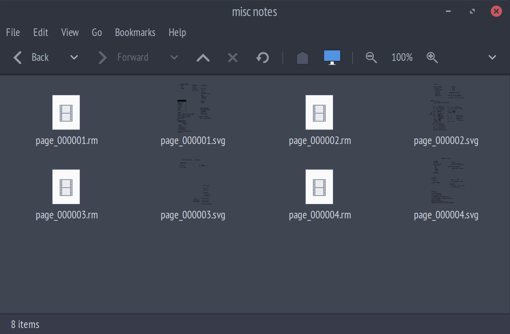

# remarkable_fuse

A fuse filesystem for remarkable tablets using version 2.x of their software (`xochitl`).

This allows you to backup the remarkable while still retaining access to your documents without requiring the use of USB or cloud services.

It's also helpful for running external tools like handwriting recognition on your documents. 

### Features
 - Provides tree view of documents as they appear in the interface.
 - Notebooks and PDF/EPUB annotations exposed as folders.
 - Auto conversion of `.rm` files to SVG.
 - Each notebook or annotation page is exposed as an individual SVG.
 - Auto landscape rotation on SVG files.

### Screenshot


### Usage
  * Sync a copy of the `xochitl` data folder over ssh to the local dir.
  ```
  scp -r root@remarkable_addr:.local/share/remarkable/xochitl .
  ```
  * Build the project
  ```
  make
  ```
  * Create a directory to be used as mount point.
  ```
  mkdir fused
  ```
  * Mount the filesystem.
  ```
  ./remfs -s -f fused
  ```

### TODO
 - Integrate a config file
 - Delete support
 - PDF/EPUB write support 
 - `.rm` to PDF support
 - PDF/EPUB annotations overlay support
 - Pattern fill for pens (eg. pencils, brush, marker)
 - Fix template background support (currently disabled)
 - SVG Polyline to `.rm` write support
 - `*.highlights.json` annotation support
