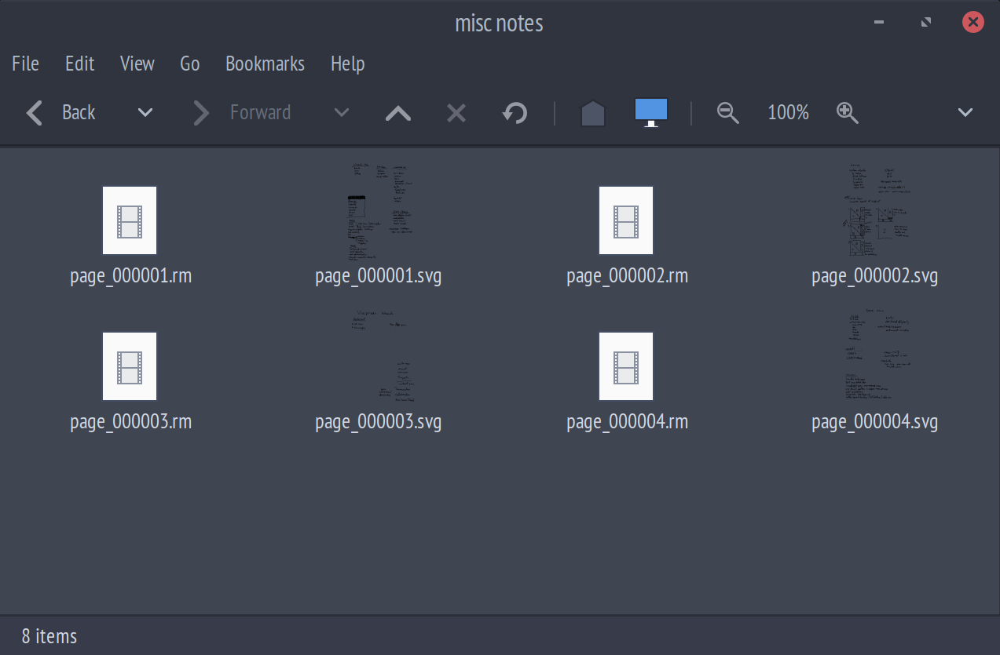

# remarkable_fuse
[](https://github.com/sleepybishop/remarkable_fuse/actions/workflows/ci.yml)

A FUSE filesystem for reMarkable tablets using version 2.x or 3.x of their software (`xochitl`).

This allows you to backup the reMarkable while still retaining access to your documents without requiring the use of USB or cloud services. It's also helpful for running external tools like handwriting recognition on your documents. 

### Features
 - Provides a filesystem view of documents as they appear in the tablet.
 - Auto-conversion of `.rm` files into `svg`, `png`, and `pdf` formats.
 - Page backgrounds (grids, lined paper) are automatically embedded into documents using the `templates/` directory.
 - Auto-landscape rotation on all exported files.
 - Native PDF annotation overlay support, exposing `<Document Name>.annotated.pdf` with drawn strokes overlaying the original document.
 - Standalone page-by-page annotation export directory (under `<Document Name> Annotations/`).
 - Mutability (write support) to create/delete notebooks, folders, and pages, and import PDFs/EPUBs directly through FUSE.

### Screenshot


### Dependencies
You will need FUSE and libpng development packages to compile the project.
```bash
sudo apt-get install libfuse-dev libpng-dev
```

### Usage
1. Sync a copy of the `xochitl` data folder over ssh to the local dir.
   ```bash
   scp -r root@remarkable_addr:.local/share/remarkable/xochitl .
   ```
2. Create a `config.json` file in the project root:
   ```json
   {
       "data_dir": "/absolute/path/to/xochitl",
       "template_dir": "/absolute/path/to/templates",
       "renderers": ["svg", "png", "pdf"],
       "svg": true,
       "png": true,
       "pdf": true,
       "mutable": false,
       "standalone_annotations": false
   }
   ```
   *(See `config.json.example` for details. Use absolute paths to ensure the FUSE daemon resolves them correctly).*

### Configuration Options

The filesystem is configured via a JSON file (by default `config.json` in the current directory, or specified via `--config=path/to/config.json`). The available options are:

- **`data_dir`** (string, default: `"./xochitl"`): The absolute path to the local copy of the reMarkable `xochitl` data folder containing files with UUID names.
- **`template_dir`** (string): The path to the directory containing templates (e.g. background grids, lined paper, custom templates). When rendering pages, `remarkable_fuse` will search this directory for PNGs matching the page's template name.
- **`renderers`** (array of strings, default: `["svg", "png", "pdf"]`): The file formats to auto-convert `.rm` files into. If defined, only the listed formats are enabled.
- **`svg`** (boolean, default: `true`): Enable or disable SVG rendering/directories.
- **`png`** (boolean, default: `true`): Enable or disable PNG rendering/directories.
- **`pdf`** (boolean, default: `true`): Enable or disable PDF rendering/directories (including annotation overlays).
- **`mutable`** or **`mutability`** (boolean, default: `false`): Enable or disable write/modification operations. When set to `true`, you can create/delete notebooks, folders, and pages directly from the FUSE mount, as well as import PDFs/EPUBs.
- **`standalone_annotations`** (boolean, default: `false`): Exposes separate page-by-page rendering directories and standalone annotations (under `<Document Name> Annotations/` containing subfolders `svg/`, `png/`, and `pdf/` with individual pages that have annotations).

3. Build the project
   ```bash
   make
   ```
4. Create a directory to be used as a mount point.
   ```bash
   mkdir fused
   ```
5. Mount the filesystem.
   ```bash
   ./remfs --config=config.json fused
   ```
   *(Note: you can unmount later using `fusermount3 -u fused` or `fusermount -u fused`)*

### Command Line Utility
You can also use the standalone `remfmt` binary to convert individual `.rm` files into other formats without mounting the filesystem:
```bash
./remfmt --template-dir templates --template-name "P Grid small" input.rm pdf > output.pdf
```

### BUGS & LIMITATIONS
  - **Horizontal Bars/Strokes**: Some horizontal strokes (e.g. crossing a "t" or drawing certain highlighter paths) are missing/not rendering properly due to limitations in the `.rm` CRDT stroke deserialization.
  - **PDF Alignment**: Annotation alignment is incorrect on PDFs with odd or changing page sizes.
  - **Text Highlights**: Text highlighting on PDFs does not store physical rectangles natively, but rather raw strings, and is not currently rendered.
  - **Strokes auto-converted to Shapes**: These are not rendered.

### NOT IMPLEMENTED
  - Typed text input parsing and rendering (v6 scene graph)


